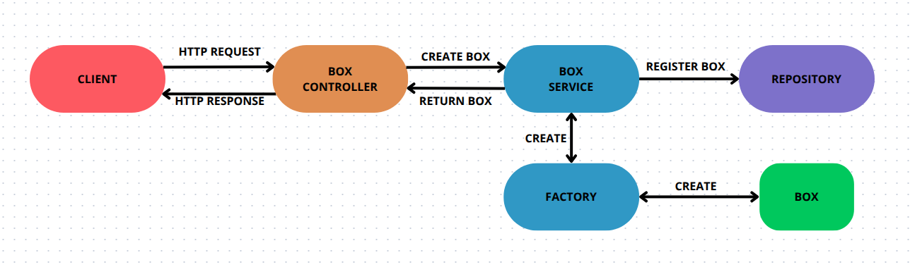
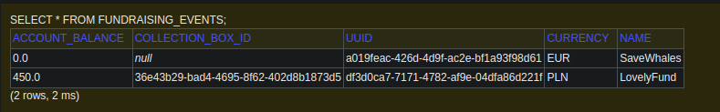

# CharityAPI 🎗️

## Overview

CharityAPI is a Java Spring Boot REST API that streamlines the management of fundraising events and collection boxes for charity organizations. It enforces strict validation of key data, including event details, monetary transactions, and currency conversions, ensuring data integrity and accurate financial reporting throughout the donation lifecycle.

For full requirements for this task see [Requirements](documentation_assets/Requirements.pdf).  


## Table of Contents
- [Application Design Overview](#application-design-overview)
- [Project Structure](#project-structure)
- [Use Cases](#use-cases)
- [Try It Out](#try-it-out)
- [Example API Endpoints](#example-api-endpoints)
- [Tests](#tests)

## Application Design Overview  

This application is built with a focus on clean architecture and maintainability. It follows well-established design patterns to keep the code organized, easy to extend, and robust. The structure ensures that each component has a clearly defined role, making the application easier to understand and work with.  

### Exception Handling  

To provide clear and specific error feedback, the application uses custom exception classes (`ArgumentsException`, `CollectionBoxException`, `FundraisingEventException`). This way, each exception is context-aware, making it easy to trace issues back to their source without relying on generic error messages.  

---

### Service and Repository Pattern  

The application is structured around the **Service and Repository Pattern**:  

- **Service Layer:** Handles the core business logic and manages interactions between the controllers and repositories. For instance, `FundraisingEventService` processes requests for creating events, assigning boxes, and transferring funds.  
- **Repository Layer:** Manages direct data access through H2, a lightweight, in-memory database. It handles CRUD operations and ensures data consistency, keeping the service layer free of data management concerns.  

---

### H2 In-Memory Database  

Data is temporarily stored in an **H2 in-memory database**, making it easy to test the application without complex setup or persistent storage. Once the application stops, all data is cleared, ensuring a clean state for each run.  

---

### Factory Design Pattern  

To manage object creation logic consistently, the application employs the **Factory Design Pattern**. Rather than creating instances of `FundraisingEvent` or `CollectionBox` directly, the factories handle initialization and validation. This approach centralizes the construction logic, ensuring that each object is correctly configured and ready for use across the application.  


## Project Structure

```
java/app/
├── controllers/   # REST API controllers
├── services/      # Business logic for managing events & boxes
├── models/        # Domain models representing events & collection boxes
├── factories/     # Factory classes for creating instances of domain models
├── repositories/  # Data access layer for interacting with the in-memory database
├── exceptions/    # Custom exception types for error handling

tests/
├── collection_box_tests/    # Unit tests for collection box management logic
├── fundraising_event_tests/ # Unit tests for fundraising event management logic
└── CurrencyConverterTests/  # Unit tests for currency conversion
```




This diagram provides a visual representation of the `CollectionBox` creation process, illustrating the interactions between the client, controller, service, factory, model, and repository.

In the **Create Collection Box** scenario, the client sends a **POST** request to `/api/boxes`, triggering the `registerBox` method in the `CollectionBoxController`. The controller delegates the creation of a new `CollectionBox` to the `CollectionBoxService`, which invokes the `CollectionBoxFactory` to generate a new instance. The service then saves the newly created `CollectionBox` via the `CollectionBoxRepository`, persisting it to the database. The controller responds with a **201 Created** status and the details of the created `CollectionBox`.

## Use Cases

#### Fundraising Event Use Cases

- **Create a new fundraising event**  
  Provision a new fundraising event with its name and account currency.

- **List all fundraising events**  
  Retrieve the list of all events, including their current account balances and currencies.

- **Get a single fundraising event**  
  Retrieve details for one event by its identifier.

- **Delete a fundraising event**  
  Remove an event and its associated account.

- **Generate financial report**  
  Produce a summary of each event’s name, total account balance, and currency.

#### Collection Box Use Cases

- **Register a new collection box**  
  Add an empty collection box to the system.

- **List all collection boxes**  
  Retrieve boxes with indicators for whether each is assigned and whether it is empty.

- **Unregister a collection box**  
  Remove a box—which automatically empties it without crediting any event.

- **Assign a collection box to an event**  
  Link an empty box to a specific fundraising event.

- **Add money to a collection box**  
  Deposit currency into an assigned or unassigned box, in one of the supported currencies.

- **Empty a collection box**  
  Transfer and convert all funds from a box into its event’s account, then reset the box to empty.


**Assumptions**

- Only one Collection Box can be assigned to Fundraising Event
- Only one Fundraising Event can use Collection Box at the same time

## Try it out

#### 1. **Run the API**  
   ```bash
   mvn spring-boot:run
   ```

#### 2. (Optional) **H2 Console**

```
URL: http://localhost:8080/h2-console
```
```

JDBC URL: jdbc:h2:mem:testdb
```
```

User: sa (no password)
```


On the image above you can see example view of the H2 console.

#### 2. **Send HTTP requests**


**Example HTTP requests**
Using curl

- Create a new Fundraising Event
```json
curl -i -X POST \                
  "http://localhost:8080/api/events?name=ExampleName&currency=ExampleCurrency"

```


-  Register a new Collection Box
```json
curl -i -X POST http://localhost:8080/api/boxes
```

- Add money to a Collection Box
```json
curl -i -X PATCH \
  "http://localhost:8080/api/boxes/ExampleBoxID/money?currency=ExampleCurrency&amount=ExampleAmount"
```

- Assign a Collection Box to a Fundraising Event
```json
curl -i -X PATCH \
  http://localhost:8080/api/events/ExampleEventID/boxes/ExampleBoxID
```

- Generate Financial Report
```json
curl -i -X GET http://localhost:8080/api/events/financial-report
```


## Example API Endpoints

### Collection Box Endpoints

- **POST** `/api/boxes`  
  Create a new collection box.

- **GET** `/api/boxes`  
  Get a list of all collection boxes.

- **DELETE** `/api/boxes/{id}`  
  Delete a collection box by its ID.

- **PATCH** `/api/boxes/{id}/money`  
  Add money to a collection box.  
  _Parameters_: `currency` (string), `amount` (double)

- **PATCH** `/api/boxes/{id}/empty`  
  Empty a collection box.

### Fundraising Event Endpoints

- **POST** `/api/events`  
  Create a new fundraising event.  
  _Parameters_: `name` (string), `currency` (string)

- **GET** `/api/events`  
  Get a list of all fundraising events.

- **GET** `/api/events/financial-report`  
  Get a financial report for all fundraising events.

- **GET** `/api/events/{id}`  
  Get a specific fundraising event by its ID.

- **DELETE** `/api/events/{id}`  
  Delete a fundraising event by its ID.

- **PATCH** `/api/events/{eventId}/boxes/{boxId}`  
  Assign a collection box to a fundraising event.

- **DELETE** `/api/events/{eventId}/collection-box`  
  Unassign the collection box from a fundraising event.

- **POST** `/api/events/{eventId}/transfer`  
  Transfer money from a collection box to a fundraising event.


## Tests

We have three test packages:

- **collection_box_tests** — Unit tests for the `CollectionBoxController`, `CollectionBoxService`, and the `CollectionBox` model class.
- **fundraising_event_tests** — Unit tests for the `FundraisingEventController`, `FundraisingEventService`, and the `FundraisingEvent` model class.
- **CurrencyConverterTests** — Unit tests for the `CurrencyConverter` logic.

All tests are written using **JUnit** for testing and **Mockito** for mocking dependencies.

To run tests:

```bash
   mvn test
```
